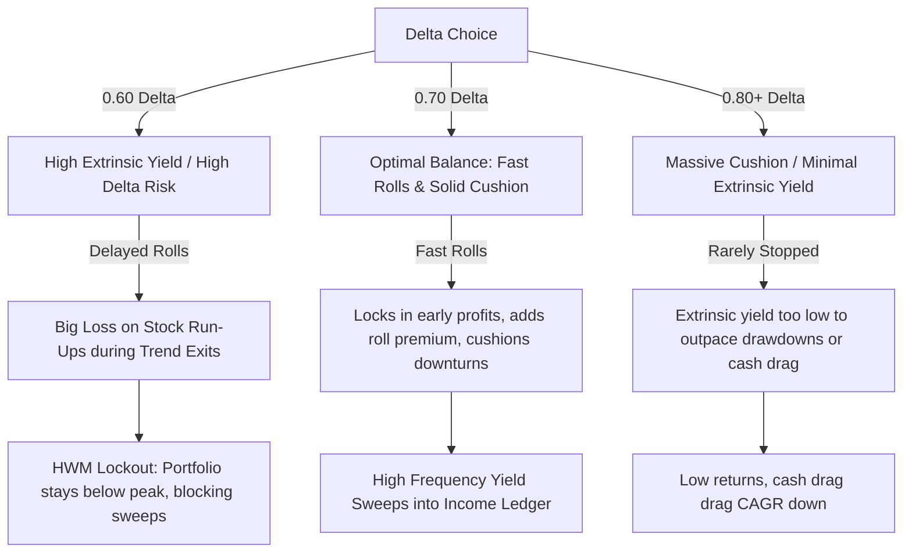

# Delta Sensitivity Analysis: The 0.65–0.70 Delta Performance Leap

In our parameter sweep for the 45 DTE TSLA covered call strategy, we observed a massive "performance leap" in the moderate ITM region:
* **0.60 Delta:** CAGR of **5.49%**, Sortino of **0.24**, and Max DD of **-24.88%**
* **0.65 Delta:** CAGR of **12.28%**, Sortino of **0.69**, and Max DD of **-15.62%**
* **0.70 Delta:** CAGR of **18.80%**, Sortino of **1.08**, and Max DD of **-14.17%**
* **0.75 Delta:** CAGR of **6.03%**, Sortino of **0.40**, and Max DD of **-32.82%**
* **0.80 Delta:** CAGR of **-1.50%**, Sortino of **-0.32**, and Max DD of **-25.70%**

This analysis dissects the underlying transaction logs and mechanics to explain why this hump occurs.

---

## 1. Executive Summary of the "Sweet Spot"

The strategy's performance is governed by a three-way trade-off between **downside protection (premium cushion)**, **yield generation (extrinsic value)**, and **roll mechanics**. 

### 1.1 The Delta Spectrum Mechanics:
* **0.60 Delta (Too Aggressive / Sticky Rolls):** It collects less premium, resulting in a tighter stop-loss and narrow cushion. More importantly, it has **high extrinsic value**, meaning it takes longer to decay to the **15% roll threshold** during stock run-ups. When TSLA rallies and then falls into a Bearish Regime, the position is liquidated via the **EMA Trend Exit** before it rolls, forcing the strategy to buy back the call at a massive loss (e.g. Cycle 1 lost **$20,770**), locking the portfolio in a High-Water Mark (HWM) lockout.
* **0.80+ Delta (Too Defensive / Yield Starved):** It has a massive premium cushion, meaning it never triggers stop-losses. However, because it is deep ITM, it has **very low extrinsic value**. It frequently goes to expiration and gets called away, generating almost zero yield. The premium is mostly intrinsic value (which is net-neutral to the stock), and the actual yield is too low to cover friction and bear market drawdowns.
* **0.65–0.70 Delta (The Sweet Spot):** The optimal balance. The premium cushion is wide enough to survive minor pullbacks. Because the option is moderately ITM, its extrinsic value is high enough to generate high yields, but **low enough that a stock rally rapidly decays it to the 15% roll threshold**. This triggers rolls early in the cycle, locking in profits, and writing a new call to collect additional premium. When the EMA Trend Exit eventually liquidates the trade, the rolled option is cheap or expired, capturing massive profits (e.g. Cycle 1 made **+$7,620**).

---

## 2. Quantitative Trade Breakdown

The table below summarizes the exact trade and liquidation mechanics parsed from the successful backtest logs:

| Baseline Delta | CAGR (%) | Sortino | Max DD (%) | Total Entries | Stop-Losses | Trend Exits | Total Rolls | HWM Sweeps | Total Income Swept |
| :---: | :---: | :---: | :---: | :---: | :---: | :---: | :---: | :---: | :---: |
| **0.60** | 5.49% | 0.24 | -24.88% | 11 | 0 | 10 | 4 | 2 | $8,960.48 |
| **0.65** | 12.28% | 0.69 | -15.62% | 12 | 0 | 11 | 6 | 3 | $24,746.77 |
| **0.70** | **18.80%** | **1.08** | **-14.17%** | **12** | **0** | **11** | **6** | **5** | **$40,220.94** |
| **0.75** | 6.03% | 0.40 | -32.82% | 12 | 0 | 10 | 6 | 3 | $17,825.38 |
| **0.80** | -1.50% | -0.32 | -25.70% | 15 | 0 | 12 | 4 | 4 | $20,371.06 |
| **0.85** | -4.65% | -0.91 | -21.71% | 15 | 0 | 12 | 3 | 5 | $10,339.77 |
| **0.88** | -4.61% | -0.93 | -21.70% | 15 | 0 | 12 | 3 | 5 | $10,420.77 |

> [!NOTE]
> The **Stop-Loss Triggers count is 0** across all deltas because the **EMA Trend Exit** (which triggers when the stock falls $\ge 5\%$ below the 50-day EMA) liquidates the position to cash during downtrends *before* the stock drops far enough to breach the static stop-loss threshold $S_{\text{stop}}$. The EMA filter acts as a highly effective soft stop-loss.

---

## 3. Key Performance Drivers

### 3.1 Position Sizing Advantage (Capital Efficiency)
Because the option contracts are written on a **fixed sizing** basis relative to current capital:
$$N_{\text{contracts}} = \lfloor \frac{\text{Current Trading Capital}}{(S_{\text{entry}} - P_{\text{entry}}) \times 100} \rfloor$$
Higher premium collection reduces the net debit ($S_{\text{entry}} - P_{\text{entry}}$), allowing the strategy to buy **more contracts** for the same $100k starting capital.
* In Cycle 1 (TSLA @ 187.44):
  * **0.60 Delta** (Premium = $17.79) → Net Debit = $169.65 → **5 Contracts (500 shares)**. Idle cash = $15,175.
  * **0.70 Delta** (Premium = $24.06) → Net Debit = $163.38 → **6 Contracts (600 shares)**. Idle cash = $1,972.
* This represents a **20% to 25% increase in capital efficiency and exposure size** in the 0.70 delta range, amplifying returns during upward and flat market regimes.

### 3.2 Roll Timing and Extrinsic Decay Dynamics
The strategy rolls when remaining extrinsic value decays below 15% of initial extrinsic value. 
* **At 0.60 Delta:** Extrinsic value is very high. In Cycle 1, TSLA rose from 187.44 to 198.88. The 0.60 call's extrinsic value decayed slowly, so it did **not** trigger a roll. When TSLA subsequently fell and triggered a trend exit at 198.88, the strategy was forced to buy back the option at **70.77** (a huge loss), resulting in a **-$20,770** cycle drawdown.
* **At 0.70 Delta:** The call has less extrinsic value at entry. During the TSLA rise, it decayed past the 15% roll threshold quickly, triggering a **ROLL** to collect an additional **$40.25** premium. When the trend exit finally occurred, this second option was cheap/expired, allowing the strategy to exit with a **+$7,620** profit and sweep cash.

### 3.3 High-Water Mark Sweep Lockout
Under the HWM rules, no profits are swept into the Income Ledger if the active trading capital is below its historical peak. 
* Because **0.60 Delta** suffered a **-$20,770** loss in Cycle 1, its trading capital fell to **$79,445**. Even though Cycles 2 and 3 were profitable, the capital remained below $100,000, so **no yields were swept** until Cycle 4.
* **0.70 Delta** never suffered a major drawdown in Cycle 1 (ended at $107,829). It was able to sweep **$7,829** in Cycle 1, **$14,211** in Cycle 2, and **$13,957** in Cycle 4, constantly siphoning yield out of the path of potential market drawdowns.

---

## 4. Conclusion

The performance leap at 0.65–0.70 delta is a structural feature of the strategy's mechanics:
1. It is deep enough ITM to trigger **highly profitable early rolls** during market run-ups, capturing multiple option premiums per cycle.
2. It is close enough to the money to collect **significant extrinsic value**, unlike the delta 0.80+ sweeps which suffer from yield starvation.
3. The resulting **drawdown avoidance** prevents the High-Water Mark sweep from locking up, allowing yield sweeps to compound the Income Ledger continuously.
