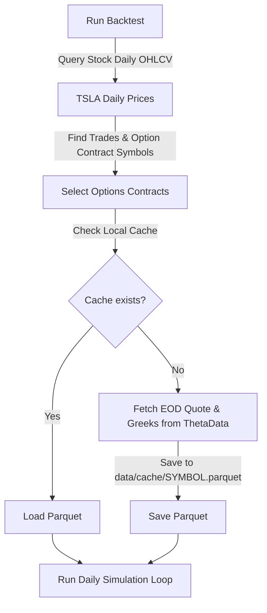
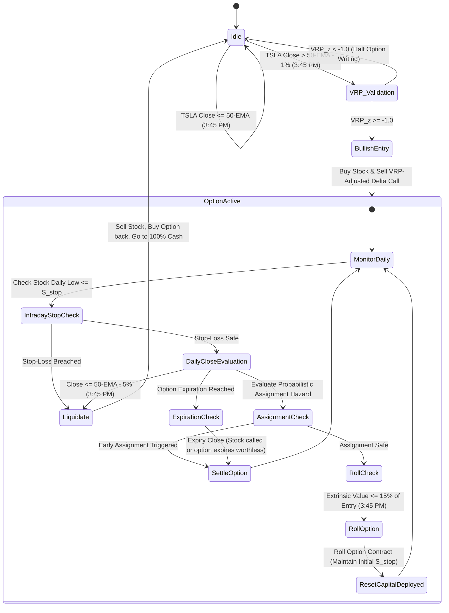

# Deep ITM Covered Call Backtester: Strategy Specification & Architecture
**Version:** Milestone 5.0 (Defensive Yield & Capital Preservation Protocol)
**Target Asset:** TSLA (Tesla, Inc.)
**Data Source:** ThetaData EOD Option Chains & Daily Stock Bars

---

## 1. Executive Summary & Strategy Objective

This document serves as the master specification ("the Bible") for the Deep In-The-Money (ITM) Covered Call Backtester. 

### Strategy Objective: Systematically Risk-Reduced Equity Income Extraction
This strategy is designed for **Systematically Risk-Reduced Equity Income Extraction** using TSLA options. It is **not** a fixed-income replacement or a principal-stable bond proxy. The investor remains exposed to overnight gap-through tail risk. 
The strategy objectives are:
1. **Normalized VRP Extraction:** We write calls across a wide spectrum of strike deltas (from moderate $0.60$ to deep ITM $0.95$) to extract the Volatility Risk Premium while minimizing directional exposure, filtered by a normalized VRP z-score.
2. **Convexity Risk Transparency:** We calculate and display the non-linear hedging breakdown (Gamma Acceleration) to quantify the collapse of the downside cushion during stock crashes.
3. **Income Siphoning via High-Water Mark:** Realized profits are siphoned off the active trading capital into an isolated ledger only when the portfolio equity exceeds its historical High-Water Mark, protecting the trading principal from capital erosion.
4. **Option A Execution Cadence:** The backtest operates on EOD (Daily) option chains. Option rolls, trend filters, and entry decisions are evaluated daily at 3:45 PM EST to ensure liquid execution, minimize data footprint, and utilize 100% real option price history.

### 1.5 Boundary & Modeling Disclaimer
This backtester is defined explicitly as:
> **"A conservative EOD approximation framework designed to pessimistically estimate execution quality under stress."**
> It does not assume perfect intraday options execution. Instead, it applies mathematical and slippage penalties to EOD options data to guarantee that simulated results err on the side of safety and understate actual returns while overstating drawdowns.

---

## 2. Quantitative Strategy Parameters & Formulas

### 2.1 Position Setup
* **Capital Allocation:** $\text{Starting Capital} = \$100,000$ (Configurable)
* **Execution Mode:** Fixed Sizing. The trade size is restricted to a fixed contract count based on current trading capital at the start of a cycle:
  $$N_{\text{contracts}} = \lfloor \frac{\text{Current Trading Capital}}{(S_{\text{entry}} - P_{\text{entry}}) \times 100} \rfloor$$
  Where $S_{\text{entry}}$ is the stock price at the cycle start and $P_{\text{entry}}$ is the slippage-adjusted option premium collected. The number of shares owned is fixed at:
  $$\text{Shares} = N_{\text{contracts}} \times 100$$

### 2.2 Mathematical Pricing & Regime-Sensitive Slippage
* **Bid-Ask Spread ($\text{Spread}_t$):**
  $$\text{Spread}_t = \text{Ask}_t - \text{Bid}_t$$
* **Regime-Sensitive Slippage Model:**
  The slippage coefficient ($SF_t$) is dynamically adjusted based on the trailing 5-day historical volatility ($\sigma_{5d}$) of TSLA and the VIX index:
  * **Low Volatility ($\sigma_{5d} < 30\%$ and VIX $< 15$):** $SF_t = 0.10$ (10% price improvement inside spread)
  * **Elevated Volatility ($30\% \le \sigma_{5d} < 50\%$ or VIX 15–35):** $SF_t = 0.0$ (Fill at exact Bid/Ask midpoint)
  * **Panic Volatility ($\sigma_{5d} \ge 50\%$ or VIX $> 35$):** $SF_t = -0.10$ (Execution crosses the spread, paying a 10% penalty)
  
  **Execution Prices:**
  $$\text{Execution Buy}_t = \text{Ask}_t - (\text{Spread}_t \times SF_t) \quad \text{(Cost to buy back option)}$$
  $$\text{Execution Sell}_t = \text{Bid}_t + (\text{Spread}_t \times SF_t) \quad \text{(Price received when writing option)}$$

### 2.3 Normalized Volatility Risk Premium (VRP) z-Score Filter
To prevent writing options when premiums are underpriced relative to actual stock moves, we implement a normalized VRP z-score filter.
* **Yang-Zhang Realized Volatility ($RV_{\text{YZ}, 20, t}$):** 
  Historical volatility is calculated using the Yang-Zhang estimator over a 20-day rolling window to capture overnight gaps and intraday ranges.
* **VRP Spread ($VRP_t$):**
  $$VRP_t = IV_{\text{ATM}, t} - RV_{\text{YZ}, 20, t}$$
  Where $IV_{\text{ATM}, t}$ is TSLA's 30-day EOD ATM Implied Volatility.
* **Normalized VRP z-Score ($VRP_{z, t}$):**
  $$VRP_{z, t} = \frac{VRP_t - \mu(VRP)_{252}}{\sigma(VRP)_{252}}$$
  Where $\mu(VRP)_{252}$ and $\sigma(VRP)_{252}$ are the 252-day rolling mean and standard deviation of the VRP spread.
* **Validation Filter Rules (Entry Gate Only):**
  *The VRP filter acts strictly as an entry gate and does not force early liquidation of active positions.*
  * **VRP Rich ($VRP_{z, t} \ge 0.5$):** Execute standard target Deltas.
  * **VRP Compressed ($-1.0 \le VRP_{z, t} < 0.5$):** Option is cheap. Shift posture to defensive: **increase target option Delta by $+0.05$** to expand our stock cushion, subject to the Delta ceiling:
    $$\text{Final Target Delta} = \min(0.95, \text{Baseline Delta} + 0.05)$$
  * **VRP Underpriced ($VRP_{z, t} < -1.0$):** Options are severely underpriced. **Trade entry is blocked, and the portfolio remains 100% in cash** (active trades are allowed to run to completion).

### 2.4 Non-Linear Spread Expansion & Stale Quote Lockout
Deep ITM options often have stale quotes. To prevent artificial liquidity and suppressed slippage in the backtester:
* **Effective Spread Expansion:**
  If an option quote is stale by $D_{\text{stale}}$ trading days:
  $$\text{Effective Spread}_t = \text{Spread}_t \times M_{\text{stale}} \times M_{\text{vol}} \times M_{\text{delta}}$$
  Where:
  * $M_{\text{stale}} = 1.0 + 0.5 \times D_{\text{stale}}$
  * $M_{\text{vol}} = 1.0 + \max(0, \text{VIX}_t - 20) / 10$
  * $M_{\text{delta}} = 1.0 + \max(0, \text{Delta}_t - 0.85) \times 2$
* **Stale Quote Lockout:**
  If an option quote is $\ge 3$ trading days stale and VIX $> 35$ (Panic Regime):
  $$\text{roll\_disabled} = \text{True}$$
  The engine freezes the position, forcing it to hold through the storm and face EOD assignment or EOD liquidation.

### 2.5 Liquidity & Volume Constraints (Phantom Liquidity Filter)
To prevent executing trades in simulated "phantom liquidity" states, option contracts must pass strict volume and liquidity checks on entry/roll days:
* **Open Interest (OI) Floor:** $\text{OI}_{\text{contract}} \ge 100$ contracts.
* **Daily Volume Floor:** $\text{Volume}_{\text{contract}} \ge 10$ contracts.
* **Spread-to-Mid Ratio Ceiling:**
  $$\frac{\text{Spread}_t}{\text{Mid}_t} \le 15.0\%$$
* **Directional Search Path:** If the target contract fails any of the liquidity filters, the engine will **scan sequentially toward the money** (lower Delta strikes) in increments of 1 strike until a contract passing all filters is found. If the target delta drops below $0.60$ during this search without finding liquidity, trade entry/roll is aborted and the portfolio remains in cash.

### 2.6 Roll, Exit, & Assignment Rules
* **Relative Extrinsic Harvest Trigger (Daily Check at 3:45 PM EST):**
  $$\text{Extrinsic}_t = \text{Execution Buy}_t - \max(0, S_t - K)$$
  $$\text{Roll Trigger} = \text{Extrinsic}_t \le (\text{Extrinsic}_{t_0} \times 0.15) \quad \text{(and roll\_disabled == False)}$$
* **Roll Driver Classification:**
  When a roll is triggered, the engine determines and logs the **Primary Roll Driver** based on the dominant pricing variable:
  * **Theta-Driven:** The option is close to expiration ($\le 3$ DTE) and spot price change was low.
  * **Delta-Driven:** The roll was forced by a rapid spot price movement that pushed the option deep ITM or close to OTM.
  * **Vega-Driven:** The roll was triggered primarily by an implied volatility crush that collapsed the extrinsic premium value.
* **Probabilistic Assignment Hazard Model:**
  Deep ITM short calls face early assignment risk when extrinsic value decays. At each daily close $t$:
  * If $\text{DTE}_t \le 10$ and $\text{Extrinsic}_t \le \$0.25$:
    Calculate the early assignment probability $P_{\text{assign}, t}$:
    $$P_{\text{assign}, t} = \min\left(1.0, \max\left(0.0, 1.0 - \frac{\text{Extrinsic}_t}{\$0.25}\right)\right) \times \left(1.0 - \frac{\text{DTE}_t}{10}\right)$$
  * Generate a random float $U_t \sim \text{Uniform}(0, 1)$.
  * **If $U_t \le P_{\text{assign}, t}$:** Early assignment occurs. The short option is settled:
    * Shares are called away: $\text{cash} = \text{cash} + (\text{shares} \times K)$
    * Reset shares to 0, close option: `active_option = None`.
    * Record early assignment event in the Trade Log.
* **Intraday Stop-Loss Circuit Breaker (Pessimistic Execution):**
  **Static Stop-Loss Rule:** The stop-loss stock price threshold ($S_{\text{stop}}$) is calculated **exactly once** at cycle setup:
  $$S_{\text{stop}} = 0.92 \times (S_{\text{initial\_entry}} - P_{\text{initial\_premium}})$$
  This threshold remains **completely static** throughout all option rolls during that cycle.
  * **Daily Low Check:** If the stock's daily `Low` $\le S_{\text{stop}}$, the stop-loss is triggered.
  * **Pessimistic Stock Execution Price:** To prevent hindsight bias and model gap-down slippage:
    $$\text{Stock Liquidation Price} = \min\left(\text{Open}_t, S_{\text{stop}} \times (1 - \text{adverse\_fill\_factor})\right)$$
    Where $\text{adverse\_fill\_factor} = 1.0\%$, and $\text{Open}_t$ captures overnight gap-downs that bypass the stop.
  * **Pessimistic Option Buyback Price:** The option is bought back using the **actual EOD Ask price** of that contract from ThetaData for that day (capturing the EOD Vega/IV spike).
* **Tiered Delta Overwrite Matrix (EMA Trend Filter):**
  To smooth out the binary cliff-effect of a simple moving average crossing, the engine adjusts target call Deltas on rolls/entries based on TSLA's distance from the 50-day EMA:
  
  | TSLA Price vs. 50-EMA | Trend Regime | Baseline Target Call Delta ($\Delta$) | Portfolio Posture |
  | :--- | :--- | :---: | :--- |
  | $\ge +2.0\%$ Above | Bullish | $0.80\,\Delta$ | Yield Harvesting |
  | $+1.9\%$ to $-1.9\%$ | Neutral Chop | $0.88\,\Delta$ | Defensive Overwrite |
  | $-2.0\%$ to $-4.9\%$ | Bearish Transition | $0.95\,\Delta$ | Max Intrinsic Cushion |
  | $\le -5.0\%$ Below | Deep Bear | None | 100% Cash Override (Liquidate to cash) |
  
  *(Note: Baseline Target Deltas are adjusted dynamically by the VRP Validation Filter prior to entry, subject to a hard maximum ceiling of $0.95\,\Delta$).*

### 2.7 Delta Instability, Vol-of-Vol, & Short-Gamma Crisis Metrics
* **Effective Portfolio Delta ($\text{Net Delta}_t$):**
  $$\text{Net Delta}_t = 1.0 - \text{Delta}_t$$
* **Volatility-of-Volatility Acceleration ($\Delta \text{IV}_t$):**
  We track implied volatility acceleration:
  $$\Delta \text{IV}_t = \text{IV}_{\text{ATM}, t} - \text{IV}_{\text{ATM}, t-1}$$
  The metrics module calculates the standard deviation of $\Delta \text{IV}_t$ over the backtest to evaluate the volatility-of-volatility impact.
* **Short-Gamma Crisis Metric ($\Gamma_{\text{stress}, t}$):**
  To quantify the exact speed of convexity/hedging failure during market selloffs:
  $$\Gamma_{\text{stress}, t} = \frac{|\text{Delta}_t - \text{Delta}_{t-1}|}{|\text{Return}_t| \times 100}$$
  Where $\text{Return}_t$ is the daily percentage stock return. A high $\Gamma_{\text{stress}}$ indicates the delta-cushion collapsed rapidly relative to the scale of the stock move.
* **Gamma Drag Analytics:**
  The engine will calculate the **Maximum Net Delta Exposure**, **Average Net Delta Exposure**, and the cumulative **Realized Gamma Drag** (net cash loss on the option buyback due to the non-linear collapse of the delta hedge relative to a static delta hedge).

### 2.8 Yield Sweep & High-Water Mark (HWM) Accounting
To prevent cash drag while maintaining fixed sizing and protecting the capital base from erosion during drawdowns, we implement a **High-Water Mark (HWM)** sweep rule:
* **HWM Initialization:** Initialize the High-Water Mark variable to the Starting Capital:
  $$\text{HWM} = \text{Starting Capital} \quad (\text{e.g., } \$100,000)$$
* **Liquidation Cash Accounting:** Yield sweeps are executed **only** when the entire stock position is liquidated and all stock and options are fully converted back to cash:
  $$\text{Ending Cash} = \text{Current Cash} + (\text{Shares} \times S_{\text{exit}}) - (N_{\text{contracts}} \times 100 \times \text{Option Buyback Price})$$
* **HWM Sweep Evaluation:**
  * **Case A: Ending Cash > HWM (Net New Profit):**
    The net new yield is siphoned out of the trading account into the `Income Ledger`:
    $$\text{Swept Amount} = \text{Ending Cash} - \text{HWM}$$
    $$\text{Income Ledger} = \text{Income Ledger} + \text{Swept Amount}$$
    The trading account cash is reset back to the HWM:
    $$\text{Current Cash} = \text{HWM}$$
  * **Case B: Ending Cash <= HWM (Capital Drawdown):**
    No sweep occurs ($\text{Swept Amount} = 0$). The HWM remains unchanged at its previous peak. The next trade cycle starts with the depleted capital:
    $$\text{Current Cash} = \text{Ending Cash}$$
* Cash sitting in the trading account during a **Cash Override** earns interest daily based on the historical 3-Month US Treasury yield ($r_d$):
  $$\text{Daily Interest} = \text{Cash Balance} \times \left(\frac{r_d / 100}{365}\right) \times dt$$
  Where $dt$ is the number of calendar days elapsed since the last trading day.

---

## 3. High-Fidelity Data Pipeline & Caching

### 3.1 EOD Caching Architecture
By evaluating rolls at the 3:45 PM daily close (Option A), we utilize EOD options data which is deterministic. The pipeline is simple and fast:



### 3.2 Data Schema

#### 1. Daily Ticker Data (`data/TSLA_daily.parquet`)
* `Date` (YYYY-MM-DD)
* `Open`, `High`, `Low`, `Close`, `Volume`
* `EMA_50` (Computed value)
* `RV_YZ_20` (Yang-Zhang historical volatility)
* `Treasury_Yield_3M` (Historical daily yield rate, decimal converted)
* `VIX` (CBOE Volatility Index close)

#### 2. Option Quote Data (`data/cache/{SYMBOL}.parquet`)
* `Date` (YYYY-MM-DD)
* `Bid`, `Ask`
* `Delta` (Used for strike selection and Delta instability tracking)
* `Implied\_Volatility` (Used to extract ATM option implied volatilities)
* `Open\_Interest` (Used for liquidity filtering)
* `Volume` (Used for liquidity filtering)

---

## 4. Backtest Execution State Machine



---

## 5. Software Architecture & Directory Layout

The codebase is built using Python 3.10+, using `polars` for fast memory-mapped dataframes, `duckdb` for partition querying, and `matplotlib` for graphing.

```text
/Users/aps/projects/Deep ITM Covered Call/
├── config.yaml               # Strategy and API parameters
├── creds.txt                 # ThetaData login credentials
├── main.py                   # Backtester Orchestrator
├── backtester/
│   ├── __init__.py
│   ├── data_loader.py        # ThetaData downloader & local Parquet loader
│   ├── engine.py             # Daily event-loop simulator
│   ├── positions.py          # State tracker (cash, shares, active options, ledgers)
│   └── metrics.py            # Risk statistics calculator (CAGR, Sortino, MaxDD, ES)
├── results/
│   ├── backtest_results.csv  # Permutations sweep log
│   └── equity_curves.png     # Strategy comparison chart
└── data/
    ├── TSLA_daily.parquet    # Cached historical daily stock bars, EMA, VIX and ^IRX rates
    └── cache/                # EOD Parquet option quotes & Greeks
```

---

## 6. Expected Output & Event-Segregated Analytics

The metric reporting module (`metrics.py`) now fundamentally isolates performance and tail-risks across specific event and volatility regimes, compared against five baseline benchmarks.

### 6.1 Performance Benchmarks
Every backtest output will generate a comparative analysis table and plot (`results/equity_curves.png`) comparing the active strategy against:
1. **Buy & Hold TSLA:** Core baseline.
2. **Standard OTM Covered Call:** 30 Delta monthly overwrite.
3. **Collar Strategy:** Buy stock, write 30 Delta OTM Call, buy 10 Delta OTM Put.
4. **Short-Duration Treasury Proxy:** Cash yielding 3-Month Treasury rates (the risk-free comparison).

### 6.2 Parameter Sensitivity & Walk-Forward Validation
To prevent curve-fitting and isolate different strategic exposures, the delta parameter sweeps are clustered into three distinct strategy regime bands:
* **Moderate Overwrite Band:** Delta $[0.60, 0.65, 0.70, 0.75]$ (Yield-enhanced long equity posture).
* **Defensive Overwrite Band:** Delta $[0.80, 0.85, 0.88]$ (Hedged equity income posture).
* **Deep ITM Carry Band:** Delta $[0.90, 0.93, 0.95]$ (Synthetic short-vol carry posture).

**Robustness Analysis:**
* **Sensitivity Heatmap:** The orchestrator will run sweeps across these bands.
* **Intra-Regime Stability Coefficient:** Calculates the variance of Sortino ratios and Max Drawdowns **exclusively within each specific regime band**, rather than aggregating across fundamentally different strategy types.

### 6.3 Performance Segregation Buckets
All return and drawdown metrics (CAGR, Sortino, MaxDD, Win Rate) will be calculated and output separately for:
1. **Earnings Weeks:** Trading weeks where TSLA releases its quarterly earnings.
2. **FOMC Weeks:** Trading weeks containing a Federal Open Market Committee rate decision.
3. **Crash Clusters:** Time periods where VIX $> 25$ or stock drops $>5\%$ in a single session.
4. **Non-Event Weeks:** Clean market regimes (excluding earnings/FOMC).

### 6.4 Trade-Level P&L Attribution & Convexity Metrics
To identify the exact sources of strategy return, the engine calculates the **Trade-Level P&L Attribution** for every closed cycle, dividing the net trade return into the following components:
* **Theta Harvest:** The positive carry generated from options time decay.
* **Delta Drift:** The directional profit/loss generated by stock price moves.
* **Gamma Drag:** The net cash loss suffered due to options delta decaying dynamically during downward stock moves (un-hedging the downside) and expanding during rebounds.
* **Vega Impact:** Profit/loss resulting from shifts in Implied Volatility during the trade.
* **Slippage Cost:** The total dollar friction paid due to spread crossings and adverse stop execution.
* **Gap Loss:** Realized losses directly caused by overnight stock gap-downs bypassing intraday stop triggers.

### 6.5 Tail-Risk & Volatility-of-Volatility Metrics
* **Expected Shortfall (CVaR - 95%):** The average return of the portfolio's worst 5% of trading days.
* **Overnight Gap Matrix:** Isolates portfolio equity drawdowns precisely at the 9:30 AM open on the top 5 largest overnight TSLA gap-downs.
* **Regime Attribution Table:** Isolates strategy performance (CAGR, Win Rate, Sortino) across VIX regimes.
* **Delta Exposure Drift:** Logs the Maximum and Average Net Delta Exposure ($1.0 - \text{Delta}_t$) reached per cycle to quantify delta-cushion collapse.
* **Realized Gamma Drag:** Calculates cumulative hedging losses.
* **Short-Gamma Crisis Indicator:** Logs the Maximum and Average $\Gamma_{\text{stress}, t}$ to measure the velocity of delta-hedge collapse during crashes.
* **Vol-of-Vol Acceleration Index:** Annualized standard deviation of daily $\Delta \text{IV}_t$ to quantify volatility acceleration exposure.
* **Assignment Hazard Frequency:** Tracks the percentage of trade cycles terminated by early assignment.
* **Liquidity Rejection Rate:** Logs the percentage of trade entry attempts rejected due to failing Open Interest, Volume, or Spread constraints.
* **VRP Attribution Log:** Summarizes the average spread between IV and RV at entry.
